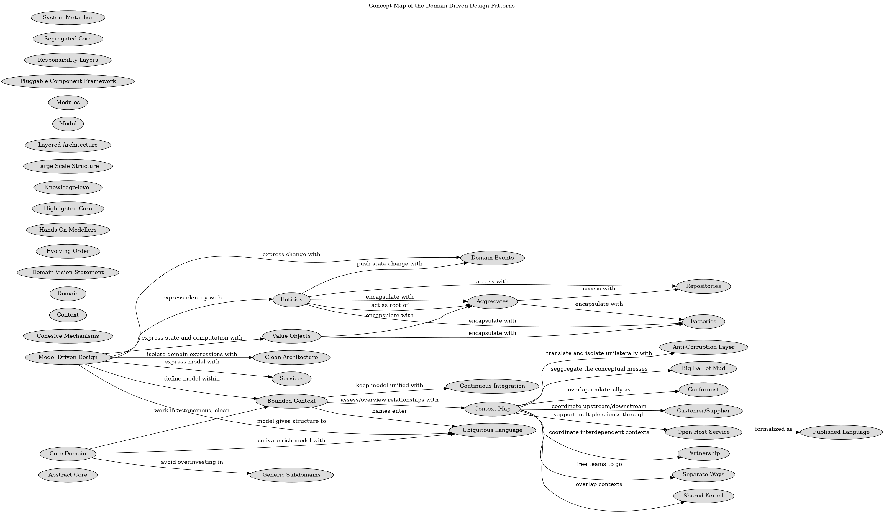

# Ubiquitous Language (Concept)
## Description
A language around the domain model used by all team members within a
bounded context to connect all the activities of the team with the software.
## Documentation
To create a supple, knowledge-rich design calls for a versatile, shared team
language, and a lively experimentation with language that seldom happens on
software projects.

A project faces serious problems when its language is fractured. Domain experts
use their jargon while technical team members have their own language tuned for
discussing the domain in terms of design. The terminology of day-to-day
discussions is disconnected from the terminology embedded in the code
(ultimately the most important product of a software project). And even the
same person uses different language in speech and in writing, so that the most
incisive expressions of the domain often emerge in a transient form that is
never captured in the code or even in writing.

Translation blunts communication and makes knowledge crunching anemic. Yet none
of these dialects can be a common language because none serves all needs.

Domain experts should object to terms or structures that are awkward or
inadequate to convey domain understanding; developers should watch for
ambiguity or inconsistency that will trip up design.

Play with the model as you talk about the system. Describe scenarios out loud
using the elements and interactions of the model, combining concepts in ways
allowed by the model. Find easier ways to say what you need to say, and then
take those new ideas back down to the diagrams and code.

With a ubiquitous language, the model is not just a design artifact. It becomes
integral to everything the developers and domain experts do together.

Therefore,

Use the model as the backbone of a language. Commit the team to exercising that
language relentlessly in all communication within the team and in the code.
Use the same language in diagrams, writing, and especially speech.

Iron out difficulties by experimenting with alternative expressions, which
reflect alternative models. Then refactor the code, renaming classes, methods,
and modules to conform to the new model. Resolve confusion over terms in
conversation, in just the way we come to agree on the meaning of ordinary
words.

Recognize that a change in the language is a change to the model.

## Concept Map

[Concept Map](../ddd/concept-view.md)

(generated with docs/concept.md.cmb)
